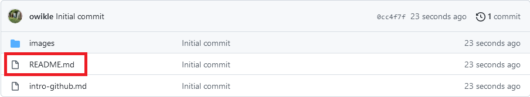
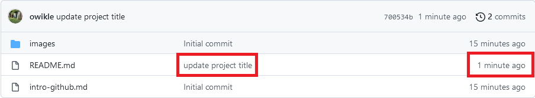
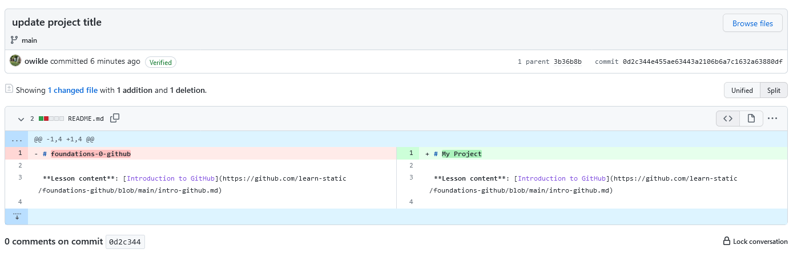

# Introduction to GitHub

Before we get started, let's clarify some terms:

[Git](https://git-scm.com/) is a popular free, distributed version control system–i.e. a piece of software used to track the history of changes in a folder of files. Git can be used on your personal computer, or by online services to track the development of a project, such as…

[GitHub](https://github.com/), a popular web platform for hosting Git repositories–i.e. a place to store and sync your project files online. Think of it as Google Drive for code with super robust "track changes" baked in. Built around the powerful version control of Git, it provides a handy web interface for managing, editing, and collaborating on repositories.

## Step 1. Create a GitHub account

1. Go to <https://github.com>
2. Click the "Sign up" button
3. Enter your email and create a username and password to complete the sign up process

## Step 2. Copy a GitHub Repository

Copy code from another repository into your own and start editing it.

1. Make sure you're logged into your account on [GitHub](https://github.com)
2. Scroll to the top of the [foundations-0-github](https://github.com/learn-static/foundations-0-github) repository and click the green "Use This Template" button (appears on the right side above the code area)
4. This brings you to a "Create a new repository" form. Follow these steps:
    1. In the **Repository name** text box, give your repository the name `github-foundations`. If you'd like to create your own name for the repository, be sure to use a lowercase name without spaces or odd characters. Dashes (`-`) or underscores (`_`) are okay.
    2. In the **Description** text box, add `A place to learn GitHub basics`.
    3. Select the option for "**Public**" repository.
    4. Leave the "Include all branches" option **Unchecked**!
    5. Click on the green button "**Create repository from template**". This will take you to your new repository.

## Step 3. Edit README file

Explore your new repository.
It contains: 
- a folder of images
- a README file
- an "intro-github" file with instructions for this lesson

1. Click on the `README.md` link. This will open your README file.



The README file is a place to describe your repository.
By default, GitHub displays the README on the repository home page, so it is often the first place visitors will look for information about your project.

2. In the top right corner of the README file, locate and click on the pencil icon.

You are now in GitHub's editing mode.

The first line at the top of the file will look like this:

```
# foundations-0-github

```

3. Delete this line of text and instead type `# My Project`.
4. Proceed to the following section to learn how to save or "commit" your changes.

## Step 4. Make a Commit

When you make a commit, Git takes a snapshot of the changes you made and permanently stores it in your repository's history.
Your "commit message" is a short description of what the changes do or why you made them--this is your note to the future to help everyone understand the code and history.

1. To commit the changes you just made to your README file, scroll to the bottom of the page where you made your README edits. You'll see a box titled "Commit changes."
2. In the text box directly underneath "Commit changes," type `update project title`, or a brief message of your choosing that indicates what changes you made to this file.
3. Skip the option to add an extended description to the commit, and keep the box checked next to "Commit directly to the main branch".
4. Click on the green "Commit changes" button. This will take you back to your repository's homepage.
5. Scroll down to the bottom of your repository to view the new title you added to the README file.

You can view recent commits on your repository's homepage.
Commit messages and their timestamps are located to the right of the repository files:



## Step 5. View the Changes

Let's take a closer look at the changes you've made to the README file:

1. On your repository's homepage, locate the README.md file link. To the right of the link, you should see the commit message you just created (it should say `update project title`).
2. Click on the commit message.

You should now see two versions of your README file, displayed side by side.
You are viewing the difference between the original version of your repository's README file (on the left), and the new version that you created by editing it (on the right). 



3. Click your repository's name (located in the top left of the window) to return to the repository's home page.

## Step 6. Add a New File to the Repository

Now it's time to add a new file to your project.

1. On your repository's home page, locate and click the "Add file" button, situated to the right above your repository's files. When this button is clicked, a drop-down menu will appear. Select the option "Create new file".
2. An option to name your file will appear toward the top of your screen. Give your file the name: `new-file.txt`
3. Add the following sentence to the body of your text file:

```
This is a new file in my GitHub repository.

```

4. Commit your new file to your repository by adding the commit message `add new file` (just as you did in the "Make a Commit" section above), and pressing the green "Commit new file" button.

## Step 7. Check Out the Repository's History

Let's view all the changes we've made to the repository so far.

1. On your repository's home page, locate the commit count for your repository, situated underneath the green "Code" button and to the right of the clock icon. It should display a number followed by the word "commits" (example: "3 commits"): 
2. Click on this commit count link.

You are now viewing your repository's history (all the commits that have ever been made to your repository).

3. Click on the commit message `update project title` to view the changes that were made as part of that commit.
4. Click your repository's name (located in the top left of the window) to return to the repository's home page.

## Step 8. Make an Issue

GitHub Issues are a great way to record tasks, identify problems, and communicate with collaborators on your own repositories as well as others'.

1. Make sure you are on your repository's home page.
2. In the navigation menu below your repository's name, locate and click on the "Issues" button. This will take you a "Welcome to issues!" page.
3. Click the green "New issue" button, located on the right side of the screen.
4. In the "Title" text box, type "My first issue."
5. In the "Write" text box, copy and paste the following description:

```
To-do:

- [ ] Complete the Learn-STATIC foundations-0-github module (https://github.com/learn-static/foundations-0-github)
- [ ] Learn more about GitHub and HTML by completing the Learn-STATIC foundations-1-html module (https://github.com/learn-static/foundations-1-html)

```

6. To preview your issue, click the "Preview" tab to the right of the "Write" tab. (Notice the `- [ ]` turn into checkboxes!)
7. When your description is finished, click on the green "Submit new issue" button.
8. Congratulations, you've successfully created an issue!
9. Click your repository's name (located in the top left of the window) to return to the repository's home page.

## Step 9. (Optional) Add a GitHub Collaborator

Most digital projects are collaborative, so you will probably want to add your collaborators to your GitHub project repository.

1. On the repository home page, click the "Settings" tab
2. On the left side nav, click "Manage access"
3. Click the green "invite teams or people" button
4. Type in a GitHub username to add (the search bar will show suggestions based on what you type). Select the correct account to add.
5. Select your collaborator's level of access to the repository. Generally if you want people to be able to edit code in the repository, give them "Write" access. Then click the green "Add" button.

Once added your collaborator will receive an email with the invitation to join your repository.
They will have to confirm the invitation before being added!
